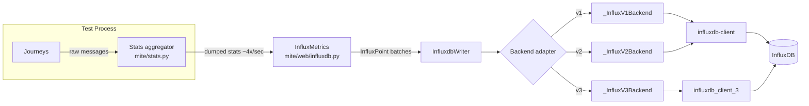
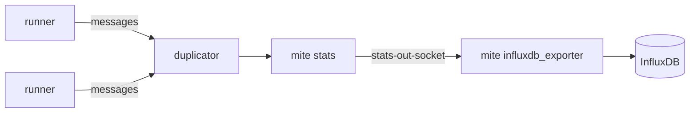

# mite.web InfluxDB Integration

This package provides the InfluxDB metrics backend for Mite. It converts the
internal stats model (`Counter`, `Gauge`, `Histogram` — see
[mite/stats.py](../stats.py)) into InfluxDB line-protocol points and writes
them to one or more InfluxDB instances, supporting InfluxDB v1, v2 and v3.

Files:
- [influxdb.py](influxdb.py) — core writer, stat aggregation/point conversion, and backend adapters
- [__init__.py](__init__.py) — Flask app exposing `/metrics` (Prometheus); also re-exports `InfluxMetrics`
- [prometheus.py](prometheus.py) — sibling Prometheus exporter (not covered here)

## Architecture



### Layers

1. **Stat model** (`InfluxStat`, `InfluxCounter`, `InfluxGauge`, `InfluxHistogram`)
   Mirror the shape of `mite.stats` types but render to `InfluxPoint` objects
   instead of Prometheus text. Each keeps running totals plus a
   `_prev_*` snapshot so that `to_points()` can emit both a delta (`value`,
   `count`, `sum`, percentiles computed from the delta buckets) and a
   cumulative value (`value_cumulative`, `count_cumulative`, ...) per flush.
   `InfluxHistogram` additionally reconstructs percentiles from histogram
   buckets (`_percentile_from_buckets`) and can optionally emit raw bucket
   points (`include_buckets=True`, Prometheus-style `le` tag) for exact
   reconstruction downstream.

2. **`InfluxMetrics`** (extends `InfluxdbWriter`)
   The stats *sink*. `process(message)` is called with a stats dump (a list
   of per-metric dicts produced by `mite.stats.Stats`). It creates/updates the
   relevant `InfluxStat` instances, buffers the resulting points, and flushes
   them to InfluxDB at a throttled cadence:
   - `MIN_FLUSH_INTERVAL = 1.0s` — stats dumps arrive roughly every 0.25s but
     a single Influx write can take longer, so points are buffered across
     several `process()` calls and flushed at a slower, steadier cadence.
   - `MAX_PENDING_POINTS = 5000` — hard cap on buffered points; oldest points
     are dropped (with an error log) if a stalled backend can't keep up, to
     bound memory on long-running tests.
   - A batch is only cleared from the pending buffer once `write_points()`
     actually accepted it (i.e. the write wasn't skipped) — otherwise a busy
     writer would silently lose points.

3. **`InfluxdbWriter`**
   The transport layer, independent of the stats model. Responsibilities:
   - Instantiates the correct backend adapter via `_create_influx_backend`.
   - Writes are asynchronous: a single-worker `ThreadPoolExecutor` plus a
     `BoundedSemaphore(1)` ensure **at most one write is ever in flight**. If
     a new batch of points arrives while a write is still pending,
     `write_points()` returns `None` immediately rather than blocking or
     queuing — i.e. writes are *fire-and-forget* and a slow backend causes
     batches to be skipped (and merged into the next flush by `InfluxMetrics`),
     never backpressure on the caller.
   - Skip accounting: logs a `WARNING` per skip, escalating to `ERROR` once
     `CONSECUTIVE_SKIP_ALERT_THRESHOLD` (50) consecutive skips occur, and
     every multiple thereof, so a backend that's permanently falling behind
     is visible without flooding logs under normal load spikes.
   - `close()` shuts down the executor (waiting for any in-flight write) and
     closes the underlying client.

4. **Backend adapters** (`_InfluxBackend` ABC)
   All adapters implement `write_points(points: list[InfluxPoint])` and
   `close()`, isolating the rest of the system from version-specific client
   APIs:
   - `_InfluxV2ClientBackend` — base class wrapping `influxdb_client.InfluxDBClient`
     with `SYNCHRONOUS` writes (used directly for v2).
   - `_InfluxV1Backend` — subclasses the v2 client backend, mapping the
     legacy `database`/`retention_policy`/`username:password` model onto the
     v2 client's `bucket`/`token` model (InfluxDB 1.8+ compatibility API).
   - `_InfluxV2Backend` — thin config wrapper around `_InfluxV2ClientBackend`.
   - `_InfluxV3Backend` — uses the separate `influxdb_client_3` package
     (`InfluxDBClient3`), InfluxDB's v3/IOx line.
   - Client imports are deferred (done inside `__init__`/`write_points`) so
     only the SDK needed for the configured version has to be installed.

   The version to use is selected via `_create_influx_backend` /
   `_create_single_backend`, which reads `INFLUXDB_VERSION` (via
   `packaging.version.Version`, so values like `1`, `2.0`, `v3` all parse —
   only the major version is used) and dispatches to the matching adapter,
   defaulting to v3 if unset.

### Multi-instance support

Every config lookup and class constructor accepts a `suffix` (e.g. `""`,
`"_2"`, `"_3"`, ...), allowing simultaneous writes to **N independent InfluxDB
instances** from a single test run — e.g. `INFLUXDB_HOST` and
`INFLUXDB_HOST_2` configure two different destinations. The `--influxdb=N`
CLI flag controls how many `InfluxdbWriter`/`InfluxDBProcessor` instances are
created, each with its own suffix.

## Configuration (environment variables)

Selected once via `INFLUXDB_VERSION{suffix}` (default `"v3"`; only the major
version matters: `1`, `2`, `3`). Remaining variables depend on the version:

| Version | Required env vars | Notes |
|---|---|---|
| v1 | `INFLUXDB_HOST`, `INFLUXDB_USERNAME`, `INFLUXDB_PASSWORD`, `INFLUXDB_DATABASE` | `INFLUXDB_RETENTION_POLICY` optional, defaults to `autogen`. Internally mapped to the v2 client (`bucket=database/retention_policy`, `token=username:password`, `org="-"`). |
| v2 | `INFLUXDB_HOST`, `INFLUXDB_TOKEN`, `INFLUXDB_BUCKET`, `INFLUXDB_ORG` | Uses `influxdb_client.InfluxDBClient` directly. |
| v3 | `INFLUXDB_HOST`, `INFLUXDB_TOKEN`, `INFLUXDB_DATABASE` | Uses `influxdb_client_3.InfluxDBClient3`. |

For a second simultaneous instance, suffix every variable with `_2`
(`INFLUXDB_VERSION_2`, `INFLUXDB_HOST_2`, ...), `_3` for a third, etc.
Missing required variables raise `InfluxConfigError`
([mite/exceptions.py](../exceptions.py)) and abort writer creation.

## Usage via `mite` CLI (in-process test run)

When running a test directly with `mite scenario test` or `mite journey
test`, pass `--influxdb=N` to attach N `InfluxDBProcessor` message processors
([mite/influxdb_processor.py](../influxdb_processor.py)) alongside the
existing message processors:

```bash
# Single InfluxDB instance (suffix "")
mite journey test --influxdb=1 mite.example:journey mite.example:datapool

# Two InfluxDB instances at once (suffix "" and "_2")
mite scenario test --influxdb=2 mite.example:scenario

# Include raw histogram buckets (le-tagged points) in addition to percentiles
mite scenario test --influxdb=1 --include-buckets mite.example:scenario
```

Each `InfluxDBProcessor` wraps its own `Stats` aggregator
([mite/stats.py](../stats.py)) and `InfluxMetrics` sink, so stats dumps are
converted to points and flushed on the cadence described above, independent
of whatever other message processors (`--message-processors`) are attached.

### Seeding metrics before a run (`influxdb init`)

```bash
mite influxdb init --influxdb=2
```

Writes a zero-valued point for every registered `mite_stats` entry point stat
(see [pyproject.toml](../../pyproject.toml) `[project.entry-points.mite_stats]`)
to each configured InfluxDB instance. This is useful so dashboards/alerts
have a baseline series to chart against before the first real test data
point arrives (see [mite/cli/influxdb.py](../cli/influxdb.py)).

## Usage as an individual component (`influxdb_exporter`)

InfluxDB writing can also run completely out-of-process, decoupled from the
test itself — useful when running distributed load tests (separate
`controller`/`runner`/`duplicator` processes) where stats are published to a
message bus rather than consumed in-process:

```bash
mite influxdb_exporter --stats-out-socket=tcp://0.0.0.0:14305 --include-buckets
```

This binds a receiver to `--stats-out-socket` (the same socket `mite stats`
publishes dumped stats to), feeds every received message into a single
`InfluxMetrics` instance (via `mite.web.influx_metrics()`,
[mite/web/__init__.py](__init__.py)), and flushes to InfluxDB on receipt —
independent of any particular test process. It reads the same
`INFLUXDB_*`/`INFLUXDB_VERSION` environment variables as above (always the
unsuffixed, single-instance config — `influxdb_exporter` does not support the
`--influxdb=N` multi-instance flag).

Typical distributed topology:



## Testing

- [test/test_influxdb_exporter.py](../../test/test_influxdb_exporter.py) —
  unit tests for `InfluxCounter`, `InfluxGauge`, `InfluxHistogram` point
  conversion, delta/cumulative field correctness, and histogram percentile
  math. These tests exercise the stat model directly and do not require a
  running InfluxDB instance or network access (no backend is constructed).

## Key classes reference

| Class | Role |
|---|---|
| `InfluxPoint` | Plain dataclass: `measurement`, `tags`, `fields`, `time_ns` |
| `InfluxStat` / `InfluxCounter` / `InfluxGauge` / `InfluxHistogram` | Convert `mite.stats` dumps into `InfluxPoint`s, tracking deltas |
| `InfluxdbWriter` | Async, single-in-flight-write transport to a configured backend |
| `InfluxMetrics` | `InfluxdbWriter` subclass; buffers/throttles/flushes points from stats dumps |
| `_InfluxBackend` / `_InfluxV1Backend` / `_InfluxV2Backend` / `_InfluxV3Backend` | Version-specific client adapters |
| `InfluxDBProcessor` ([mite/influxdb_processor.py](../influxdb_processor.py)) | Message processor wiring a `Stats` aggregator to `InfluxMetrics` for in-process test runs |
